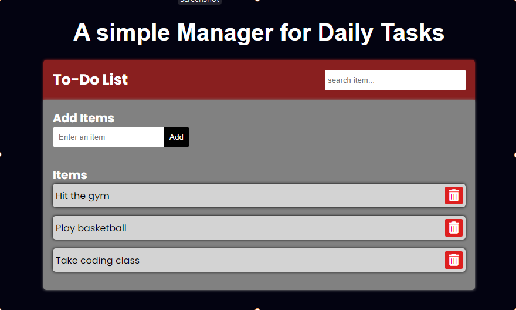

# To-Do List
 A simple Manager for Daily Tasks.

> Live demo, click [_here_](https://task360.netlify.app). 

## Table of Contents
* [General Info](#general-information)
* [Technologies Used](#technologies-used)
* [Features](#features)
* [Screenshots](#screenshots)
* [Setup](#setup)
* [Project Status](#project-status)

## General Information
 A simple task Manager, that enables a user to maintain day-to-day tasks or list everything that he/she have to do. Built using HTML5, CSS3 and Vanilla JS

## Technologies Used
- HTML5
- CSS3 
- JAVASCRIPT 

## Features
In this version of To-Do List, the user will be getting four options:
- Create (add) a new task or adding a new To-Do 
- View all the To-Dos thar were added.
- Delete any To-Do from the list of To-Dos with confirmation box to proceed.
- Filter the added To-Dos.

## Screenshots

## Setup
To build this project, the following are required:
- Text editor: This is needed to write your code. You can use any text editor of your choice. In this case, i used VSCode. click [_here_](https://code.visualstudio.com/Download) to download 

- Browser: You can use any brower of your choice, e.g: Chrome, Firefox etc. it is always advisable to test your program across multiple browers to check compatibility.

## Project Status
Project is: _complete_

